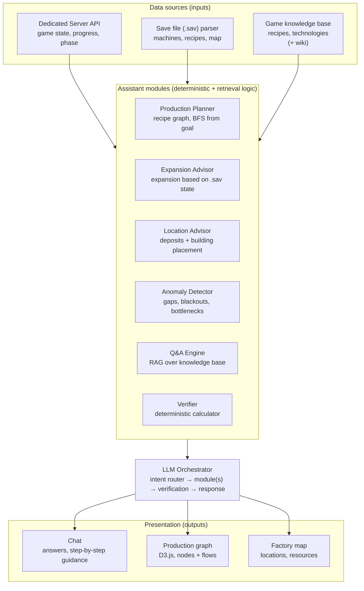
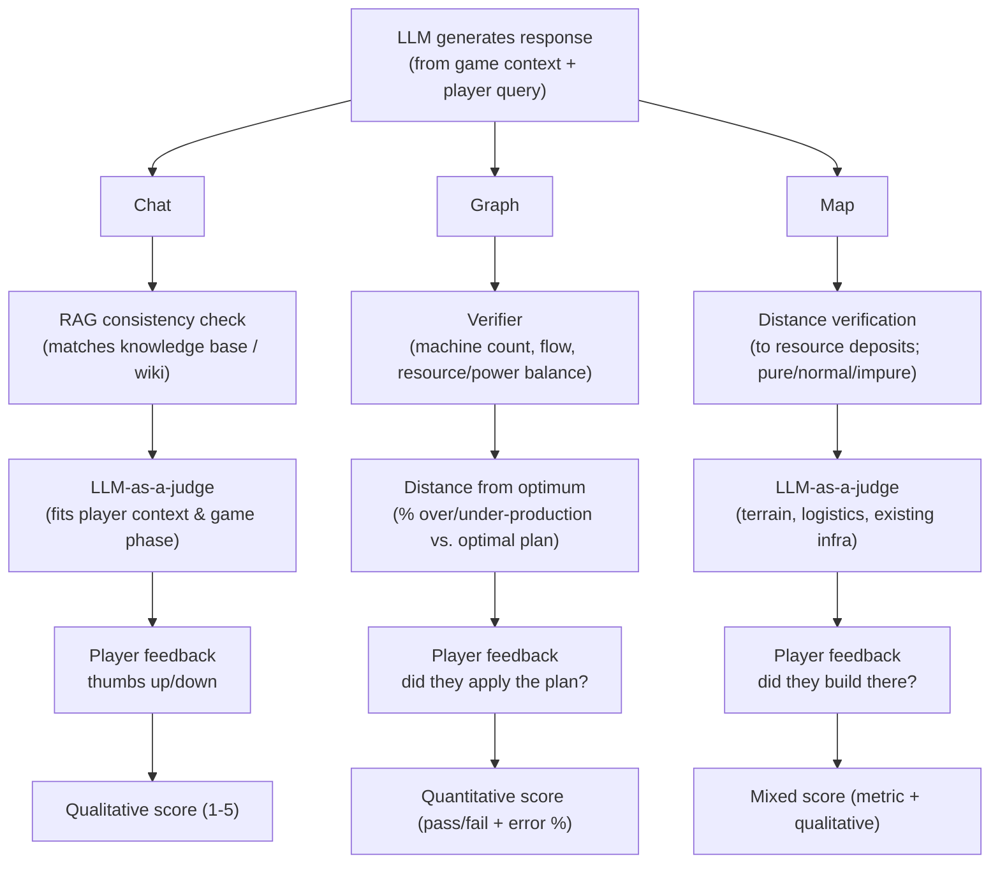

# Pioneer — Satisfactory AI Planning Assistant — Architecture

> Source: distilled from `Satisfactory AI Planner.pdf` (project vision deck). This document is the
> canonical architecture reference for both human contributors and AI coding agents working in
> this repository. If code and this document disagree, treat this document as the intended design
> and either fix the code or update this file in the same change — don't let them silently drift.

## 1. Problem statement

[Satisfactory](https://www.satisfactorystation.com/) is a first-person factory-building game
(Coffee Stain Studios, 2019 early access → 2024 full release, 5.5M+ copies sold). The player lands
on an alien planet and must build an increasingly complex factory for the FICSIT corporation:
extract raw resources, automate their processing, and chain together production lines to hit
throughput goals (e.g. "produce 10 units of X per minute"). As the game progresses, recipes,
machines and logistics options multiply, and production chains span multiple factories scattered
across a large, *fixed* map (resource deposits never move and never run out — this determinism is
what makes the problem tractable for tooling).

By the late game the planning problem is genuinely hard:

- Many production nodes, each requiring its own factory.
- Factories must be distributed across the map because resources are geographically constrained.
- This becomes a large combinatorial optimization + logistics problem (belt/pipe throughput,
  power balance, alternate recipes, tech unlock ordering).

Community tools already exist (e.g. satisfactorytools.com) but share three weaknesses this project
is meant to fix:

1. All game state must be entered by hand — there's a lot of it.
2. They don't know what the player has *already built* (no save-file awareness).
3. They don't reason about *map location* (where deposits are, what's already nearby).

**Pioneer** is an AI assistant that removes all three limitations by reading the player's actual
game/server state and reasoning over it directly.

## 2. Scope

### In scope (what the assistant does)

- Optimize existing production chains.
- Plan logistics: belt/pipe throughput and routing.
- Extend existing production chains to hit new targets.
- Design new factory plans from scratch.
- Recommend alternate recipes.
- Plan the power grid.
- Advise on technology unlock order.
- Answer general game-mechanics questions.
- Visualize proposed plans as graphs and map overlays.

### Out of scope / known limitations

- Requires a **dedicated server** (no support for listen-server/hosted-by-client play).
- **Singleplayer only** for v1.
- The save file is only a **snapshot** of the factory at load time, not a live stream — state can
  go stale between reads.
- **No vehicle or train/rail planning.**

Design implication: every module must degrade gracefully when a data source is missing or stale
(e.g. no dedicated server reachable → the assistant can still answer static Q&A and produce
theoretical plans, just without "what do I already have" context).

## 3. Architectural pattern: LLM agent with tool use

Pioneer is **not** a chatbot that generates factory plans by free-form generation. It is an
**LLM agent with tool use** wrapped around **deterministic engineering code**:

- The LLM's job is to *reason and plan*: understand player intent, decide which module(s) to
  invoke and in what order, and turn structured module output into a natural-language answer.
- The LLM **never** computes production math itself (machine counts, throughput, power balance,
  distances). Every number in a response must be traceable to a deterministic module.
- All domain calculations live in plain, testable, deterministic code — the LLM calls into them as
  tools/functions, the same way it would call any other API.

This split is the single most important invariant in the system: **reasoning is probabilistic,
arithmetic is deterministic.** Keep them in separate code paths so the deterministic half can be
unit-tested without ever invoking a model.

### 3.1 LLM runtime

The LLM runs **locally**, not against a hosted provider API. Every module that talks to it
(Orchestrator, Q&A Engine) does so through an **OpenAI-compatible chat/completions endpoint** —
that interface is the fixed assumption; the specific local backend behind it (Ollama, llama.cpp,
vLLM, LM Studio, ...) is an implementation choice deferred to the stage that first needs it (Q&A
Engine, implementation.md Stage 11) and swappable later without touching calling code. Config
(`pioneer.config.Settings`) exposes this as `llm_base_url` + `llm_model`, with `llm_api_key`
optional since most local setups don't require one.

## 4. High-level data flow

### 4.1 Data layer

| Source | Provides | Freshness |
|---|---|---|
| Dedicated server API | live game state, player progress, current tech phase | live |
| Save file (`.sav`) parser | placed machines, configured recipes, map/building layout | snapshot at load time |
| Static game knowledge base | recipes, buildings, technologies (from game files) | static, ships with the assistant |
| Static resource database | resource node locations, purity (impure/normal/pure) | static, ships with the assistant |
| Game wiki | supplementary lore/mechanics text for Q&A | static, periodically refreshed |

All five are treated as read-only inputs. No module ever writes back to the game or the save file.

### 4.2 Assistant modules (logic layer)

Each module is an independently testable unit with a narrow responsibility. The LLM Orchestrator
calls modules as tools; modules never call the LLM directly (Q&A Engine and Verifier are the two
exceptions worth noting below).

| Module | Responsibility | Primary inputs | Nature |
|---|---|---|---|
| **Production Planner** | Given a target output rate, build/extend a recipe graph via BFS/graph search from the goal backward to raw resources | Knowledge base, Verifier | Deterministic |
| **Expansion Advisor** | Given a new target and the player's *existing* factories (from `.sav`), decide the minimal set of changes (extend factory A, add a linking stage, etc.) instead of planning from scratch | `.sav` state, Production Planner, Verifier | Deterministic |
| **Location Advisor** | Recommend where to place new buildings, based on remaining unclaimed deposits and their purity/distance | Static resource DB, `.sav` state | Deterministic |
| **Anomaly Detector** | Scan the current factory for problems: under/over-production gaps, power blackouts, belt/pipe congestion | `.sav` state, Verifier | Deterministic |
| **Q&A Engine** | Answer free-form game-mechanics questions | Knowledge base + wiki via RAG | Retrieval + LLM |
| **Verifier** | Ground-truth calculator: machine counts, throughput, resource balance, power balance | Knowledge base, module outputs | Deterministic |

The **Verifier** is a shared dependency, not a leaf module — Production Planner, Expansion Advisor
and Anomaly Detector all call into it rather than duplicating arithmetic. Treat it as the single
source of truth for "is this plan numerically valid."

### 4.3 LLM Orchestrator

The orchestrator is the only component allowed to talk to the LLM for planning purposes (the Q&A
Engine's RAG step is the other LLM touchpoint, scoped to answer synthesis). Its loop:

1. **Route intent** — classify what the player is asking for (new plan / expand existing / locate
   a factory / diagnose a problem / general question).
2. **Invoke module(s)** — call the relevant module(s) above as tools, in whatever order the intent
   requires (e.g. Production Planner → Verifier → Expansion Advisor).
3. **Verify** — pass module output through the Verifier (and, where relevant, an LLM-as-a-judge
   pass — see §6) before it reaches the player.
4. **Respond** — compose the final answer across the three presentation channels (§4.4).

Because the orchestrator only ever receives already-verified, structured module output, its own
failure mode is limited to *misrouting* or *poor phrasing* — it cannot introduce arithmetic errors.

### 4.4 Presentation layer

A single assistant response is composed of three parts, rendered together:

| Channel | Content | Notes |
|---|---|---|
| **Chat** | Natural-language answer, step-by-step instructions, general Q&A | Primarily prose; wraps the other two channels in words |
| **Production graph** | The proposed/updated production chain | Rendered client-side with D3.js; nodes = machines/recipes, edges = material flow |
| **Factory map** | Proposed or referenced factory location(s) | Overlaid on the static map; shows resource nodes and purity |

Not every response needs all three — a pure Q&A answer may only populate Chat.

## 5. Example end-to-end flow

> "I want to produce 10/min of resource X."

1. Player states the goal in Chat.
2. Orchestrator pulls current state from the dedicated server and the latest `.sav`.
3. Orchestrator asks the knowledge base for X's recipe(s).
4. Production Planner walks the existing production graph (from `.sav`) to see what's already
   built toward X or its inputs.
5. Planner determines the minimal change: extend two existing factories and add one new stage
   joining their outputs — no new factory needed.
6. Verifier checks the resulting graph balances (inputs/outputs, machine counts, power).
7. Orchestrator responds: Chat explains the required changes, Graph shows the updated production
   chain highlighting what's new vs. what already existed.

## 6. Verification & feedback

Every response type has its own verification pipeline, ending in player feedback that should be
captured and fed back into quality tracking (this is evaluation infrastructure, not a gate that
blocks responses from being sent):

Three verification styles, matching the legend from the source design:

- **Deterministic** — Verifier, distance calculations: pure code, no LLM, exact pass/fail.
- **LLM-as-a-judge** — RAG consistency review, contextual/terrain fit: a second LLM pass scoring
  the *first* LLM's output against retrieved ground truth or contextual fit. Never used for
  arithmetic, only for subjective/contextual fit.
- **Player feedback** — thumbs up/down or behavioral signal (did they apply the plan / build at
  the suggested spot), the ultimate ground truth signal for model/prompt iteration.

Implication for implementation: every module's output should be structured (not just prose) so
that the Verifier and LLM-as-a-judge stages have something concrete to check against, and so
player feedback can be attached to a specific plan/graph/location rather than a whole chat session.

## 7. Design invariants (read this before writing code)

1. **No arithmetic in the LLM path.** Anything numeric (rates, machine counts, distances, power)
   is computed by the Verifier or another deterministic module and passed to the LLM as already-
   computed structured data.
2. **Read-only game access.** No module writes to the dedicated server or `.sav` file.
3. **Static data ships with the assistant.** Knowledge base and resource DB are versioned data
   sets, decoupled from live game/server calls — building/testing modules doesn't require a
   running game instance.
4. **Modules are independently testable.** Each module in §4.2 should have a stable input/output
   contract (plain data structures in, plain data structures out) so it can be unit-tested without
   the orchestrator or an LLM in the loop.
5. **Graceful degradation.** If the dedicated server is unreachable or no `.sav` is loaded, the
   assistant still answers using knowledge base + Q&A Engine only, and says so explicitly rather
   than guessing at factory state.
6. **Every response is attributable.** Any claim in a Chat answer, any edge in a Graph, any pin on
   the Map must trace back to a specific module call, so verification (§6) and player feedback can
   target it precisely.

See [implementation.md](implementation.md) for the build order derived from these boundaries.
